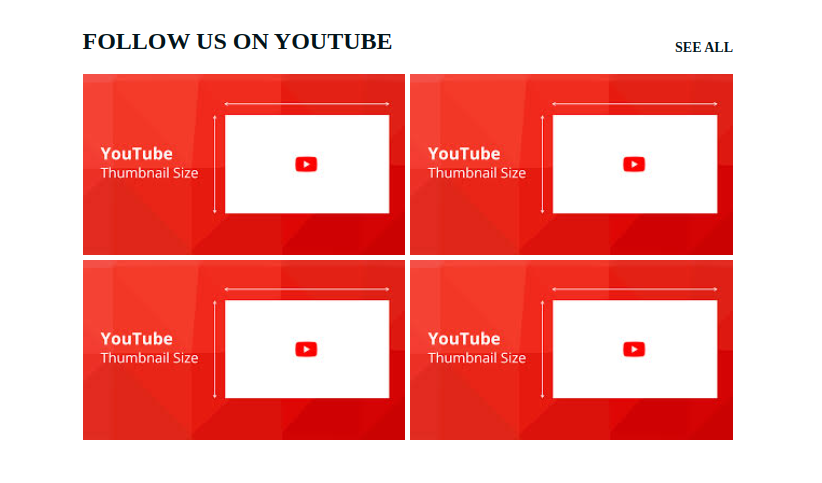

# Kadoco Stock Alert for Guests for Magento 2

## Overview

This module, developed by Kadoco, integrates to your YouTube channel. It downloads the thumbnail to your videos and allows you to create .phtml files / static block where you can display your latest YouTube video on your website.  

## Features

* Display grid of your thumbnails of your YouTube video on your website. Links to your videos on youtube.

* Integration which runs according to your settings in cron.xml.
* Admin setting where you enter your YouTube API access token and YouTube channel url for full integration.
* Contains cli commands you can use to update by demand.
* There is a page called base-url/youtube you can use to test if you can see the latest 60 thumbnails.

## Contributing

For any contributions, please make a pull request. We appreciate any contributions to improve this project.

## License

This project is licensed under the APACHE-2.0 - see the [LICENSE.md](LICENSE.md) file for details

## Support

If you encounter any issues or require further information, please contact hej@kadoco.se.
